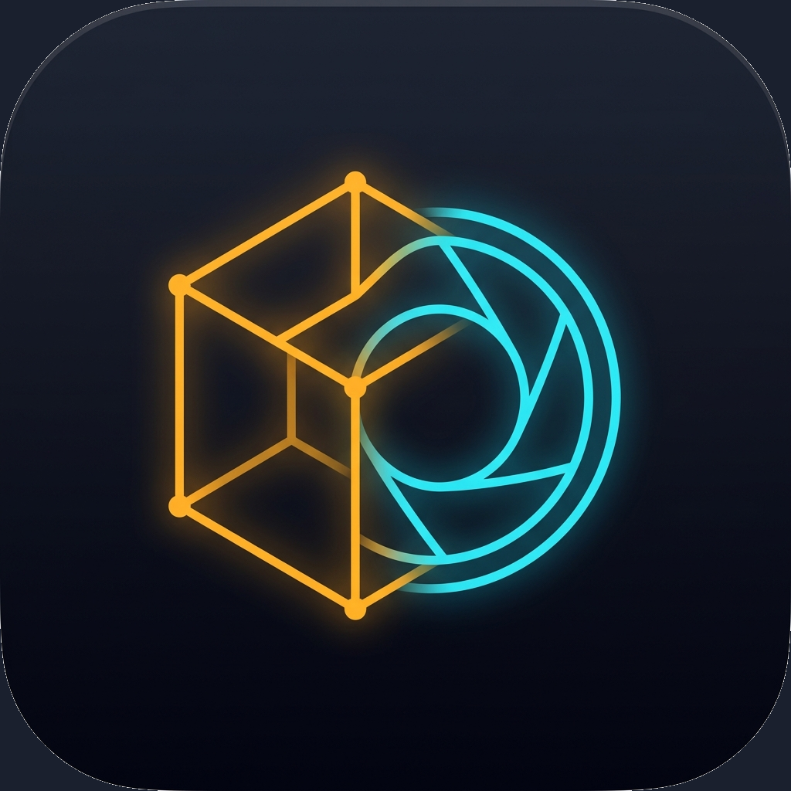

# Fusion 🔮✨
### Escáner 3D LiDAR, Modelador AR Interactivo y Cámara Manual Profesional para iPhone 16 Pro Max

  

Reconstrucción y evolución arquitectónica de alto rendimiento del proyecto ObjectScanner, desarrollada en **Swift 6 y SwiftUI (iOS 18+)** para exprimir al máximo el hardware del **iPhone 16 Pro Max** (Chip Apple A18 Pro, sensor Fusion de 48 MP, Ultra Gran Angular de 48 MP, teleobjetivo tetraprisma de 5x, escáner LiDAR de última generación, sensor TrueDepth frontal y botón Camera Control).

---

## ⚡ Compilación Automática en la Nube (GitHub Actions)

El repositorio incluye un flujo automatizado de integración continua en [`.github/workflows/build.yml`](.github/workflows/build.yml):

1. **Runner**: `macos-15` con **Xcode 16** en procesadores Apple Silicon.
2. **Generación de Artefactos**: Cada `push` a la rama `main` compila y genera automáticamente el binario empaquetado **`Fusion.ipa`**.
3. **Instalación Directa**:
   - Descarga el archivo `Fusion-iOS-IPA` desde la pestaña **Actions** de tu repositorio en GitHub.
   - Instálalo en tu iPhone 16 Pro Max usando tu herramienta de sideloading favorita (**TrollStore, AltStore, Sideloadly, Scarlet o Esign**) o firmándolo con tu Apple ID personal.
   - Si creas un tag (ej. `v1.0.0`), GitHub Actions creará automáticamente un **Release** con el `.ipa` listo para descargar.

---

## 🚀 Capacidades Principales

### 1. Cuatro Motores de Escaneo 3D
* **Fotogrametría Guiada con LiDAR (Object Capture)**:
  * Órbita guiada con caja de delimitación 3D en tiempo real.
  * Soporte para sobre-captura en alta resolución de 48 MP.
  * Detección multi-pase para escanear la base inferior volteando el objeto.
  * Diagnóstico de poses resueltas (cobertura acimutal, dispersión de elevación y alineación de fotogramas).
* **Mesa Giratoria en Trípode (Turntable Photogrammetry)**:
  * iPhone fijo en trípode con el objeto rotando.
  * Bloqueo estricto de parámetros ópticos (enfoque, exposición y balance de blancos fijos) para evitar variaciones de intrínsecos.
  * Rechazo automático de fotogramas con desenfoque de movimiento mediante análisis de energía del gradiente Laplaciano.
  * Inyección de escala métrica real mediante mapas de profundidad LiDAR embebidos en cada HEIC.
* **TrueDepth (Sensor Frontal Infrarrojo)**:
  * Sensor TrueDepth IR estructurado combinado con odometría visual-inercial de 6 grados de libertad (6DoF) de la cámara trasera.
  * Filtrado espacial en cuadrícula voxel-hashing a 1.5 mm.
  * Exportación directa a nube de puntos binaria métrica PLY.
* **Habitación y Espacios (Apple RoomPlan con LiDAR)**:
  * Clasificación semántica de paredes, puertas, ventanas, accesos y mobiliario.
  * Exportación paramétrica (cajas arquitectónicas limpias para planos) y malla real LiDAR.
  * Generación opcional de modelo fotográfico texturizado complementario.

---

### 2. Estudio y Modelador 3D AR Interactivo
A diferencia de simples visualizadores pasivos, **Fusion** incluye un estudio 3D interactivo directamente en el dispositivo:

* **Viewport 3D Multimodal**:
  * **PBR Realista**: Materiales físicamente precisos con iluminación dinámica, reflejos y sombras.
  * **Wireframe**: Inspección de topología, aristas y densidad poligonal.
  * **Normales de Superficie**: Mapa de colores RGB para verificar orientación de caras y vectores normales.
  * **Nube de Puntos**: Visualización directa de los vértices muestreados.
  * **Arcilla (MatCap Clay)**: Acabado monocromático neutro para evaluar geometría pura sin texturas.
  * **Sin Iluminación (Albedo)**: Color base puro sin sombreado artificial.
* **Herramientas de Edición y Modelado**:
  * **Cortador de Base Planar (Floor / Table Slicer)**: Plano de corte 3D interactivo con deslizador de altura $Y$ para recortar y descartar la superficie de la mesa o suelo capturada debajo del objeto.
  * **Simplificador / Diezmador de Malla (Decimator)**: Reducción poligonal ajustable (75%, 50%, 25%, 10% Low-Poly) para videojuegos, Realidad Aumentada o web.
  * **Editor de Transformación y Alineación**: Centrado de pivote en $(0,0,0)$, asentamiento del punto inferior al suelo ($Y=0$), rotación de 90° en ejes X/Y/Z y escalado métrico.
* **Espacio de Realidad Aumentada (AR Studio)**:
  * Colocación en superficies reales horizontales y verticales mediante RealityKit.
  * **Bloqueo de Escala 1:1**: Comprueba las dimensiones reales del objeto en el entorno físico.
  * **Regla Láser AR Interactiva**: Toca cualquier par de puntos sobre el modelo o la habitación para trazar una línea láser 3D con indicador de distancia flotante en milímetros, centímetros y pulgadas.

---

### 3. Cámara Manual Profesional
Convierte tu iPhone 16 Pro Max en una cámara manual de cine y precisión:

* **Controles Manuales de Sensor**:
  * **Velocidad de Obturación**: Desde 1/8000s hasta 1s continuo.
  * **Sensibilidad ISO**: Rango completo desde ISO 25 hasta ISO 3000+.
  * **Compensación de Exposición (EV)**: De -3.0 EV a +3.0 EV en pasos de 1/3 EV.
  * **Enfoque Manual con Peaking**: Deslizador de posición de lente con **Focus Peaking en tiempo real** (destaca en verde neón los bordes nítidamente enfocados).
  * **Balance de Blancos**: Ajuste en grados Kelvin (2500K a 9000K).
* **Formatos Profesionales**:
  * **Apple ProRAW 48 MP** (DNG de 14 bits).
  * **HEIF Max 48 MP** y **JPEG Max 48 MP**.
* **Herramientas de Composición y Exposición**:
  * **Histograma en Tiempo Real**: Análisis de luminancia de 64 bandas en vivo.
  * **Horizonte Artificial Giroscópico**: Nivelador de alabeo (roll) y cabeceo (pitch) con chasquido háptico al nivelarse a 0°.
  * **Cuadrícula de Composición**: Regla de tercios y guías de encuadre.
  * **Selector de Lentes**: 0.5x (13 mm), 1x (24 mm Fusion), 2x (48 mm crop) y 5x (120 mm tetraprisma).
  * **Integración con Camera Control**: Compatible con las APIs de iOS 18 para el botón físico capacitivo y háptico del iPhone 16 Pro Max.

---

### 4. Matriz de Exportación 3D
* **USDZ**: Nativo de Apple, compatible con AR Quick Look, iOS, macOS y visionOS con materiales PBR.
* **OBJ + MTL**: Malla estándar para Blender, Maya, Unreal Engine, Unity y ZBrush con texturas difusas.
* **STL (Binary)**: Formato estándar para corte e impresión 3D (Bambu Studio, PrusaSlicer, OrcaSlicer, Cura) a escala métrica exacta.
* **PLY**: Nube de puntos y malla para CloudCompare y MeshLab.
* **Paquete ZIP de Origen**: Archivo comprimido con todas las fotos de 48 MP, mapas de profundidad LiDAR y archivo JSON de poses para reconstrucción de máximo detalle (.raw) en Mac.

---

## 🛠 Requisitos del Sistema

| Componente | Especificación |
|---|---|
| **Dispositivo** | iPhone 16 Pro Max (compatible con iPhone 12 Pro a 16 Pro con LiDAR) |
| **Sistema Operativo** | iOS 18.0 o posterior |
| **Entorno de Compilación** | Xcode 16.0 o posterior (macOS) / GitHub Actions (macOS-15) |
| **Lenguaje** | Swift 6.0 con SwiftUI, RealityKit, SceneKit, ModelIO, RoomPlan y AVFoundation |
